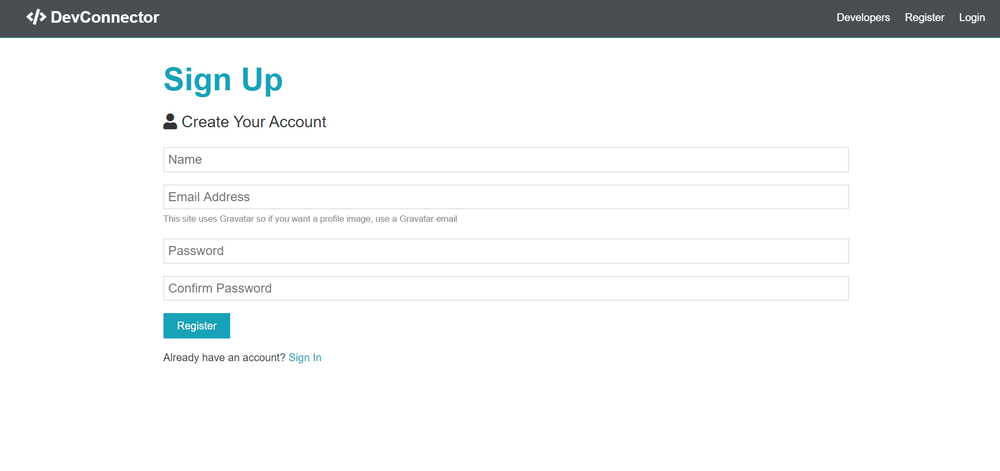

# Developers-Blog
In this project you Register yourself as a developer and creates your profile by adding your contact details,skills in which you are working and your educational details.and you can easily search and contact to other developers and also create posts and on that post all developers can discuss about it.
## Installation
1)Clone this repository<br/>
for server:
```bash
npm i
```
for Front-End:
```bash
cd client
```
```bash
npm i
```
2)add your connection string for mongodb and github in config/default.json and config/production.json
## Start
in root folder:
```bash
npm run dev
```
this command runs two command for server(npm run server) and frontend(npm run client)
## Usage
This Project uses reactjs,react-icons,redux, reactstrap and Moongoose,nodejs,Express,cors,jsonwebtoken.

## Demo




